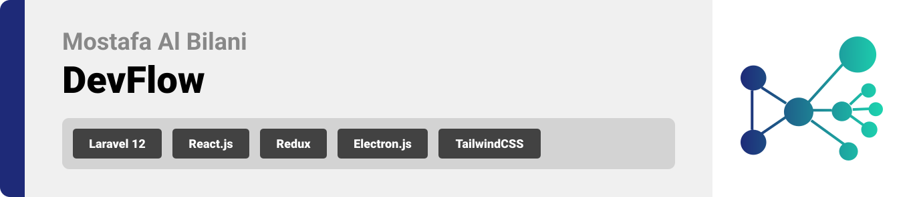
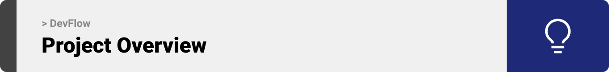
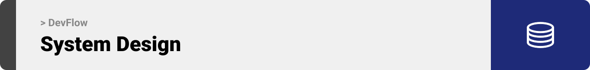
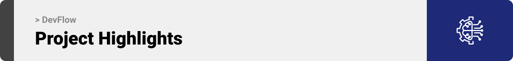
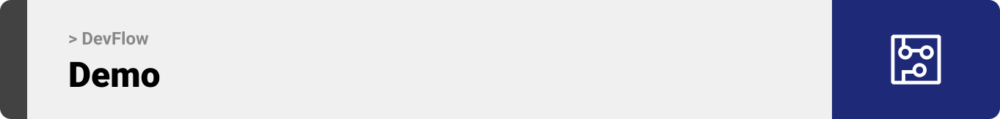
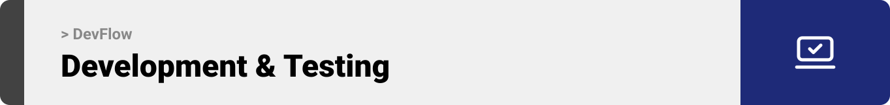
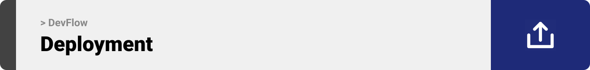

<!-- Title 1: Slogan -->

---

<!-- Title 2: Project Overview -->

## Project Overview

DevFlow is an AI-powered platform that enhances the management of GitHub repositories.  
It assists developers by rewriting unclear commit messages, providing visual insights into repository activity, and generating ready-to-use CI/CD pipelines.

Designed for individual developers and small teams, DevFlow simplifies common tasks, improves code quality, and automates repetitive processes — all accessible through a native desktop application built with Electron.js.

---

<!-- Title 3: System Design -->

## System Design

The system architecture of DevFlow is divided into three main layers:

- **Frontend:**  
  Built using React.js and Redux, providing a dynamic and responsive user interface for interacting with GitHub repositories and displaying visual insights.

- **Backend:**  
  Developed with Laravel 12, handling authentication (OAuth2 with GitHub), commit rewriting logic using AI services, repository data processing, and generating CI/CD pipelines.

- **Desktop App (Electron.js):**  
  The entire platform is wrapped inside an Electron shell, allowing DevFlow to run as a native desktop application on Windows, macOS, and Linux.

- **Database:**  
  MySQL is used to store user sessions, settings, and repository metadata.

Communication between the frontend, backend, and Electron environment is secured via APIs and local event listeners.

---

<!-- Title 4: Project Highlights -->

## Project Highlights

- **AI-Powered Commit Rewriting:**  
  Automatically rephrase unclear or messy commit messages into professional, readable formats.

- **Repository Insights Dashboard:**  
  Visualize commit history, pull request activities, and general repository health through interactive charts and reports.

- **Auto-Generated CI/CD Pipelines:**  
  Instantly generate GitHub Actions workflows tailored to your project's stack and deploy setup.

- **Pull Request Assistant:**  
  AI suggestions to improve pull request titles and descriptions, making reviews faster and clearer.

- **Desktop Integration:**  
  Seamless local access to repositories and version control actions through a secure Electron-based app.

---

<!-- Title 5: Demo -->

## Demo

*A demo video and screenshots demonstrating DevFlow's main functionalities will be added soon.*

- Repository Connection
- Commit Rewriting Example
- Visual Insights Dashboard
- CI/CD Pipeline Generator

(*Demo content will be uploaded after project finalization.*)

---

<!-- Title 6: Development & Testing -->

## Development & Testing

The project followed a feature-first development approach with weekly agile sprints.  
Each core functionality (authentication, commit rewriting, repository metrics, CI/CD generation) was developed and tested individually before integration.

**Testing Approach:**
- **Backend:**  
  Used Laravel’s built-in testing tools for API validation, service layer logic, and authentication workflows.

- **Frontend:**  
  Manual testing through browser and Electron app environment to ensure smooth UI/UX transitions and functionality correctness.

- **Error Handling:**  
  Implemented proper validation, fallback states, and user-friendly error messages across the platform.

Focus was placed on clean code practices, reusable components, and responsive design.

---

<!-- Title 7: Deployment -->

## Deployment

The backend Laravel application was containerized using Docker for consistency across environments.

Deployment was carried out on an AWS EC2 instance with the following steps:
- Dockerized backend containers (Nginx, PHP-FPM, MySQL)
- SSL certificates were installed for secure connections
- GitHub Actions configured for continuous integration (CI)

The Electron app runs locally after connecting to the deployed backend, providing a smooth desktop experience for users.

---
