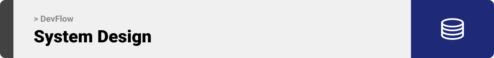
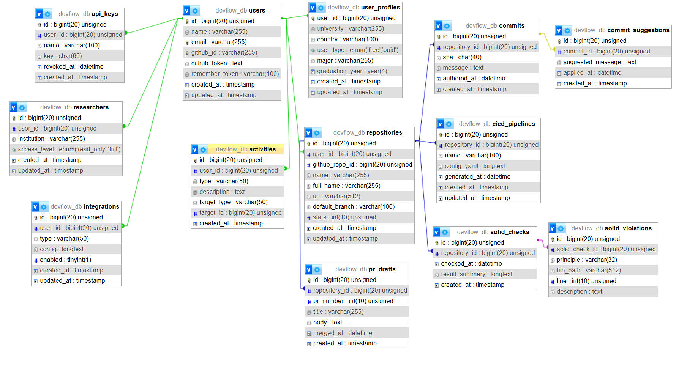

  

<!-- project overview -->

> DevFlow is an AI-driven developer workspace that unifies repository management, CI/CD automation, and analytics into one seamless platform.  
> It analyzes commits, suggests improvements, and automates deployment pipelines so developers can focus on writing quality code.  
> With DevFlow, every push triggers intelligent insights and every merge powers your production workflow.

  

<!-- System Design -->

### System Design

The backend of DevFlow is built on a robust relational schema powering users, repositories, commits, pipelines, analytics, and settings.

#### ER Diagram

The database is structured around core entities:

- `users`, `user_profiles`, `user_types`: handle authentication, roles (free, paid, researcher), and user metadata.  
- `repositories`, `commits`, `commit_suggestions`: store repo details, commit history, and AI-enhanced commit messages.  
- `cicd_pipelines`, `pipeline_runs`: manage CI/CD definitions and execution logs.  
- `analytics`, `metrics`: capture code quality stats, test coverage, and usage trends.  
- `settings`: user preferences for themes, notifications, and third-party integrations.

  

<!-- Project Highlights -->

### Project Highlights

- **Automated CI/CD pipelines** defined and executed directly from the UI.  
- **AI-powered commit suggestion engine** that refines messages and enforces best practices.  
- **Deep repository analytics** with visualizations for code health, test coverage, and activity trends.  
- **GitHub OAuth integration** for seamless authentication and repo access.  
- **Role-based access control** supporting free, paid, and researcher users.

  

<!-- Demo -->

### Demo Screens (Web)

| Dashboard                                        | Repository View                                 | Commit History                                  |
| ------------------------------------------------ | ----------------------------------------------- | ------------------------------------------------ |
|         |      |             |

| Profile Page                                     | Analytics Page                                  |
| ------------------------------------------------ | ----------------------------------------------- |
|             |        |

  

<!-- Development & Testing -->

### Development & Testing

This section highlights how DevFlow structures its core logic, validation, and automated tests.

- **Services:** Business logic for commit analysis, pipeline orchestration, and analytics is encapsulated in service classes following SOLID principles.  
- **Validation:** All requests pass through dedicated form request classes to enforce data integrity and security.  
- **Testing:** Unit tests cover the commit suggestion engine and integration tests validate end-to-end CI/CD workflows.

| Services                                             | Validation                                         | Testing                                           |
| ---------------------------------------------------- | -------------------------------------------------- | ------------------------------------------------- |
|       |  |          |

  

<!-- Deployment -->

### Deployment Overview

- The DevFlow frontend and backend are containerized with Docker for consistency across environments.  
- CI/CD is orchestrated via GitHub Actions, automating tests and deployments on every push to main.  
- The application is hosted on AWS EC2:

  - **Staging:** `http://35.180.8.108`  
  - **Production:** `http://35.180.36.19`

| Postman API – List Repositories                         | Postman API – Create Commit                          | Postman API – Trigger Pipeline                       |
| ------------------------------------------------------- | ---------------------------------------------------- | ---------------------------------------------------- |
|         |      |  |

  
